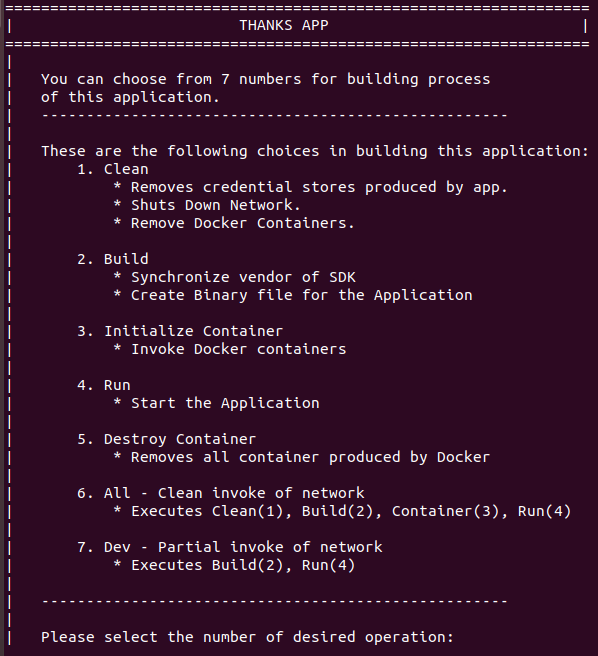
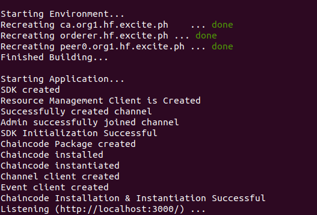

# Thanks App

### Ensure Installation of Hyperledger Fabric first:

Installation notes can be found [here](http://hyperledger-fabric.readthedocs.io/en/release-1.1/getting_started.html)

---
1. Clone Repository
- **NOTE**: use *thanksapp* as project folder name

```
git clone git@gitlab.com:mugima/hyperledger-fabric-test.git thanksapp
```

2. Change Directory
```
cd $GOPATH/src/github.com/thanksapp
```

3. Initialize Project
```
sh initialize.sh
```

4. Execute Shell File
```
sh build.sh
```

5. You will be see an interactive prompt that looks like this


6. Choose Option # 6 to Build Project

7. To verify that you have successfully build the project, The output should look like this


8. You can access it using
```
http://localhost:3000/
```